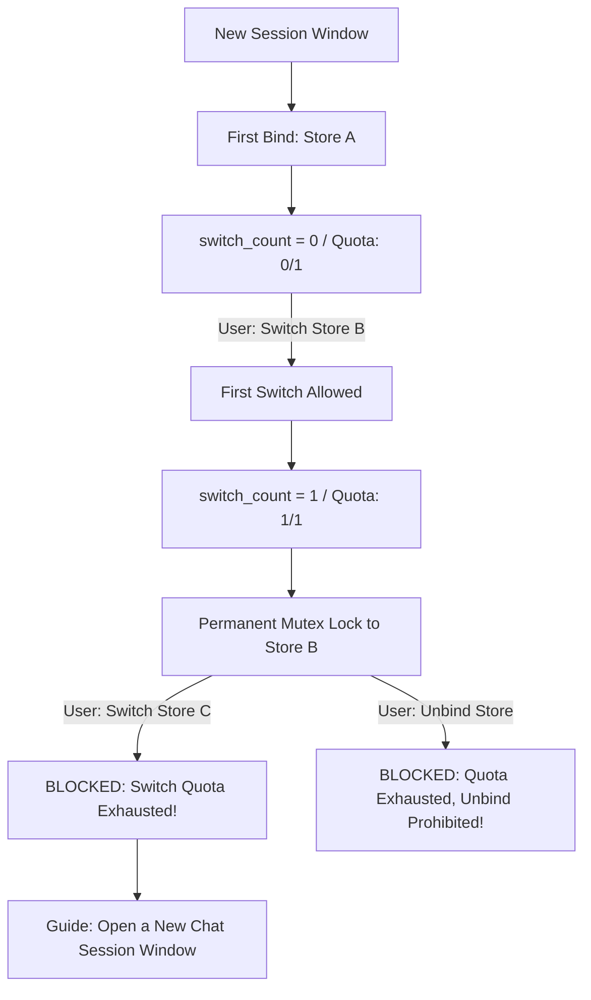

# Anti-Carousel Store Mutex & 1-Switch Quota Limit

This reference documents the multi-tenant isolation architecture designed to stop "store-carousel piracy" and prevent accidental cross-store inventory pollution.

---

## 1. The Store Carousel Threat & Confusion Risk

In multi-store e-commerce platforms (like Wildberries, Amazon, Ozon):
1. **Store Carousel Exploitation**: A customer pays for a 1-store license, but uses scripts to rapidly switch between 50 different client stores (`bind Store 1` ➔ `upload 100 items` ➔ `switch to Store 2` ➔ `upload 100 items` ...). This allows them to service dozens of stores on a single license.
2. **Catastrophic Cross-Store Pollution (串店)**: If a single chat session or agent window handles multiple stores simultaneously, any delayed network response or race condition can upload Store A's inventory and barcodes into Store B, causing stock cancellation penalties, seller account suspension, and severe financial losses.

---

## 2. Core Defense Rules



### 1. Single-Window 1:1 Mutex Locking
Every conversation session window is strictly bound to at most **one** store profile (`store_name`, `wb_api_token`, `warehouse_id`). Concurrently mixing two or more stores in one window is strictly prohibited.

### 2. Maximum 1-Switch Quota Limit (`switch_count <= 1`)
- **Initial Bind**: `switch_count = 0`. Status displays `换店配额: 0/1 (允许切换1次)`.
- **First Switch**: If a user mistyped credentials or moved stores, they are granted **one** smooth switch to Store B. Upon switching, `switch_count` increments to `1`.
- **Permanent Lock**: Once `switch_count >= 1`, the session enters permanent lock state (`1/1 (已永久锁定当前店铺，禁止再次更换)`). Further attempts to switch are blocked with:
  > `❌【换店配额超限】本会话窗口已达到最大换店次数限制 (1/1)。为了防止商品串店与多店铺混淆，当前窗口已永久锁定至当前店铺！如需管理其他店铺，请新建一个聊天会话窗口并在新窗口中绑定。`

### 3. Anti-Bypass Deadlock (Blocking Unbind)
A common bypass tactic is for the user to call `解绑店铺 (unbind)` to reset state, then call `bind` again.
To close this loophole:
`unbind_store()` checks if `switch_count >= 1`. If so, unbinding is explicitly blocked, preventing any state-clearing reset loop.

### 4. Master VIP Exemption
System administrators using a designated master key (e.g. `LIC-MASTER-2026-VIP`) are completely exempt from switch quotas, with status displaying `换店配额: 无限制 (超级管理员)`.

---

## 3. Session Registry State Schema

Stored in `~/.wb_session_registry.json`:

```json
{
  "sessions": {
    "b39c9fcb-d154-4a42-8b1f-33a70369bb56": {
      "status": "AUTHORIZED",
      "license_key": "LIC-RSA-...",
      "activated_at": "2026-09-15 01:00:00",
      "bound_store": {
        "store_name": "Store_Alpha",
        "wb_api_token": "eyJhbGciOi...",
        "wb_warehouse_id": 2200658,
        "warehouse_name": "Moscow Warehouse 1",
        "switch_count": 1,
        "bound_at": "2026-09-15 01:05:00"
      }
    }
  }
}
```
