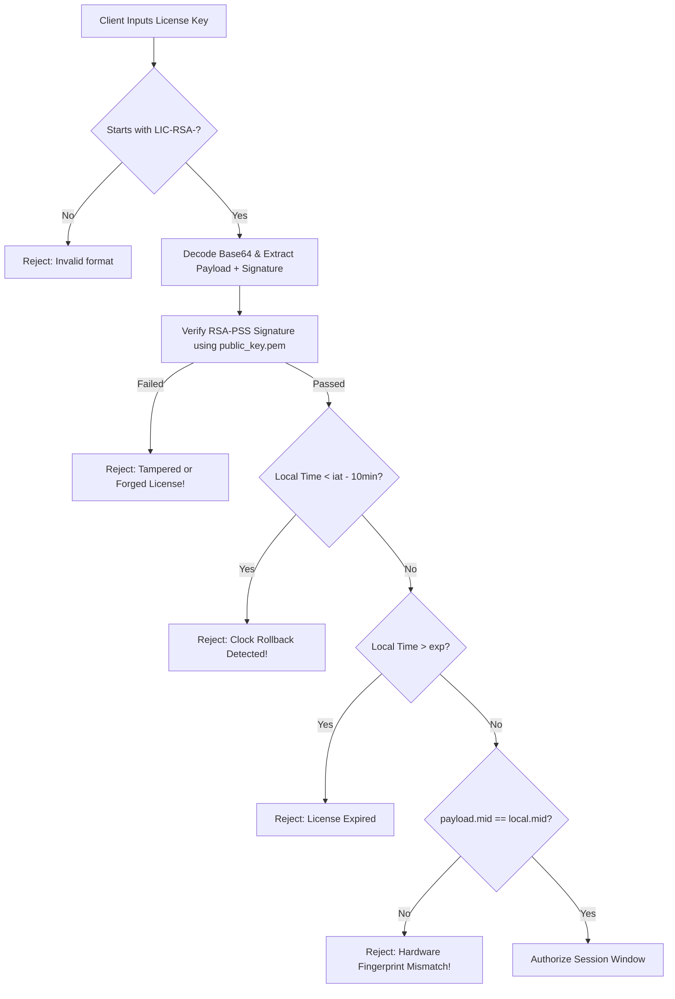

# Hardware Fingerprint Binding & RSA-2048 Cryptographic Licensing

This reference documents the zero-infrastructure, cryptographically tamper-proof licensing system designed to bind commercial software and Agent Skills to specific physical devices.

---

## 1. Threat Model & Design Goals

| Threat Vector | Attack Scenario | Countermeasure |
| :--- | :--- | :--- |
| **Key Sharing / Multi-Machine Piracy** | Customer purchases 1 license and shares the string across 50 employee PCs. | Hardware Fingerprint (MID) derived from physical motherboard and CPU. License signature incorporates the MID. Running on another machine triggers instant cryptographic rejection. |
| **Token Forgery & Tampering** | Customer edits the license token to extend expiration date or increase session count. | RSA-2048 digital signature with PSS padding. Modifying even 1 bit invalidates the signature. |
| **Private Key Extraction** | Attacker reverse-engineers client files to find the private key. | Private key (`admin_private_key.pem`) is strictly retained on the vendor's local machine and **never** shipped in client packages. |
| **System Clock Rollback** | Customer turns back their OS date to bypass license expiration. | System checks current timestamp against the license issue timestamp (`iat`). If local time is prior to `iat`, execution is blocked. |

---

## 2. Hardware Fingerprint (Machine ID) Extraction

The Machine ID is an immutable, hardware-level unique identifier formatted as:
`MID-XXXX-XXXX-XXXX-XXXX`

### Generation Pipeline
1. Query OS-level hardware identifiers:
   - **Windows**:
     - Motherboard UUID: `(Get-CimInstance -Class Win32_ComputerSystemProduct).UUID`
     - CPU Processor ID: `(Get-CimInstance -Class Win32_Processor).ProcessorId`
     - System Drive Serial: `(Get-CimInstance -Class Win32_LogicalDisk -Filter 'DeviceID="C:"').VolumeSerialNumber`
   - **macOS**: `IOPlatformUUID` via `ioreg -rd1 -c IOPlatformExpertDevice`
   - **Linux**: `/etc/machine-id` or `/var/lib/dbus/machine-id`
2. Combine all available hardware strings with colon separators:
   `raw = "{node}:{machine}:{processor}:{motherboard_uuid}:{cpu_id}:{disk_serial}"`
3. Apply cryptographic salt and pepper:
   `salted = "SALT_LIC_COMMERCIAL_V3::{raw}::STATIC_PEPPER_2026"`
4. Compute SHA-256 hash:
   `hash = SHA256(salted).hexdigest().upper()`
5. Format into 4 chunks of 4 characters prefixed by `MID-`:
   `MID = f"MID-{hash[0:4]}-{hash[4:8]}-{hash[8:12]}-{hash[12:16]}"`

---

## 3. Cryptographic License Structure (RSA-PSS-SHA256)

### Key Specifications
- **Algorithm**: RSA-2048
- **Padding**: PSS (Probabilistic Signature Scheme) with MGF1 (SHA-256) and maximum salt length
- **Digest**: SHA-256

### License Payload Schema (`p`)
```json
{
  "v": "2.0",
  "mid": "MID-A51C-F5A2-8A9A-5388",
  "name": "Customer Co., Ltd",
  "max_s": 1,
  "iat": "2026-09-15 00:00:00",
  "exp": "2027-09-15 23:59:59",
  "perm": ["listing", "pricing", "stocks", "fast_list"]
}
```

### Full Token Format
The digital signature is generated over the canonical UTF-8 JSON representation of the payload (sorted keys, compact separators).
```json
{
  "p": { ...payload... },
  "s": "<Base64-encoded RSA-PSS Signature>"
}
```
The entire JSON object is Base64 encoded and prefixed with `LIC-RSA-`:
`LIC-RSA-eyJwIjp7...`

---

## 4. Verification Flow



---

## 5. Administrative Commands

```bash
# 1. User retrieves local hardware fingerprint
python scripts/license_tool.py machine-id
# Output: MID-A51C-F5A2-8A9A-5388

# 2. Vendor generates RSA-2048 keypair (done once on vendor machine)
python scripts/license_tool.py keygen --out-dir .

# 3. Vendor issues a license bound to user's MID
python scripts/license_tool.py generate \
    --key-path admin_private_key.pem \
    --mid "MID-A51C-F5A2-8A9A-5388" \
    --name "Customer A" \
    --days 365

# 4. Client verifies the license locally
python scripts/license_tool.py verify \
    --key "LIC-RSA-..." \
    --pubkey-path public_key.pem
```
