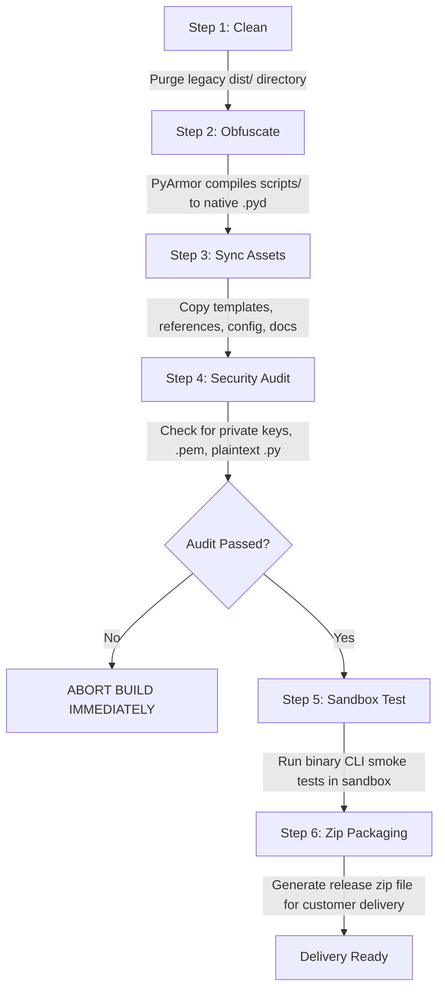

# Binary Obfuscation, Source Stripping & Protected Package Assembly

This reference details how to protect commercial Python code, Agent Skills, and automated business workflows from prompt copying, code tampering, and reverse engineering.

---

## 1. Why Obfuscation & Source Stripping is Required

When releasing AI Agent Skills or Python applications to commercial customers:
- **Plaintext Exposure**: Python `.py` files and Agent markdown prompts can be trivially read, edited, cloned, and resold.
- **License Bypass**: If the license verification logic resides in plaintext Python, a malicious user can simply comment out `if not valid: return False` and run forever without authorization.
- **Key Extraction**: Inexperienced developers often accidentally bundle private keys, test tokens, or proprietary scraping selectors into client packages.

---

## 2. PyArmor C-Extension Protection Architecture

PyArmor compiles Python source files into native Windows C-extensions (`.pyd` or `.so`) with multiple layers of hardening:
1. **Control Flow Flattening**: Replaces standard function control flow with randomized state machines.
2. **Bytecode Encryption**: Bytecode is encrypted and only decrypted just-in-time inside the native C-extension runtime.
3. **Dynamic Memory Dump Protection**: Prevents memory inspection tools from dumping plaintext bytecode.
4. **Binding to Runtime Package**: The generated binary extensions can only run in conjunction with the official PyArmor runtime library.

---

## 3. Automated 6-Step Build Pipeline

The build pipeline (`scripts/build_pipeline.py`) automates packaging into a single repeatable command:



### Execution Command
```bash
python scripts/build_pipeline.py \
    --project-dir . \
    --output-dir dist \
    --name "my-product-v3.0-protected"
```

---

## 4. Security Leakage Audit Rules (Step 4)

Before creating the distribution zip, the automated auditor traverses every file in the output directory and asserts:

| File Pattern | Severity | Policy |
| :--- | :--- | :--- |
| `*private*.pem`, `admin_private_key.pem` | **CRITICAL** | Must NOT exist in `dist/`. Private key must remain strictly on the vendor machine. |
| `*.key`, `*.secret` | **CRITICAL** | Must NOT exist in `dist/`. |
| `.env`, `*.env` | **CRITICAL** | Must NOT exist in `dist/`. Real API tokens must not be packaged. |
| `scripts/*.py` containing real business logic | **HIGH** | Files in `dist/scripts/` must be PyArmor binary wrappers; actual business code must be compiled into `.pyd`. |
| `logs/`, `.system_generated/`, `*.log` | **MEDIUM** | Runtime logs and temporary traces must be excluded. |

If any violation is detected, the build script raises `RuntimeError` and terminates immediately.

---

## 5. Client Package Contents

The final client package (`dist/my-product-v3.0-protected.zip`) contains:
- `scripts/`: Native C extensions (`.pyd`) and PyArmor runtime. Zero plaintext business logic.
- `public_key.pem`: RSA public key for offline cryptographic verification.
- `templates/` & `references/`: Category rules, configuration templates.
- `config.example.json`: Client configuration template with placeholders.
- `README.md` & `USER_MANUAL.md`: User operation manuals.
- `.agents/skills/`: Agent skill definition pointing to the protected binaries.
