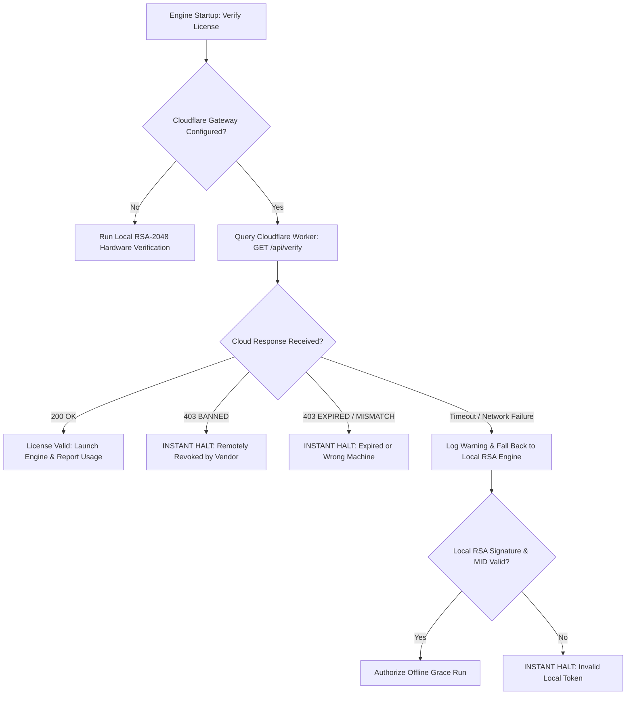

# Resilience, Edge Cases & Threat Countermeasures

This reference covers the subtle yet critical security, network, and operational edge cases that prevent system outages and close security evasion loopholes.

---

## 1. The Dual-Engine Fallback (Cloud-First + Offline RSA Resilient Fallback)

### The Dilemma
- **Pure Cloud Verification**: If Cloudflare is blocked by regional firewalls (e.g. Russian domestic telecom blocks, corporate proxy restrictions) or experiences a cloud outage, legitimate paying customers cannot work, creating severe customer support crises.
- **Pure Offline Verification**: The vendor has no way to remotely revoke pirated keys or monitor usage.

### The Solution: Hybrid State Machine


> [!IMPORTANT]
> **Key Rule**: A network failure triggers the local RSA fallback, but an explicit **HTTP 403 (BANNED)** response from Cloudflare MUST NEVER trigger the fallback! The ban flag is authoritative.

---

## 2. Anti-Time-Rollback Defense (Clock Skew Detection)

### Threat
A customer with an expiring license changes their operating system date from `2027` back to `2025` to extend their license indefinitely.

### Defenses
1. **Issued-At Comparison (`iat`)**:
   Every RSA license contains the timestamp of creation (`iat`). If `current_time < iat - 10 minutes`, the system detects clock rollback and blocks immediately.
2. **Monotonic High-Watermark Timestamp**:
   Every time the tool runs successfully, it records `last_seen_timestamp = max(last_seen_timestamp, current_time)` in the registry. If the user rolls the clock back before `last_seen_timestamp`, execution is blocked.

---

## 3. Atomic Registry Persistence

### Threat
If a user forces-quits Antigravity or a power outage occurs while `session_manager` is writing `~/.wb_session_registry.json`, the JSON file can become truncated or corrupted (0 bytes), locking all valid sessions out.

### Atomic Write Pattern
```python
import tempfile, os, json

def atomic_save_registry(file_path, data):
    dir_name = os.path.dirname(file_path)
    with tempfile.NamedTemporaryFile('w', dir=dir_name, delete=False, encoding='utf-8') as tf:
        json.dump(data, tf, indent=2, ensure_ascii=False)
        temp_name = tf.name
    # Atomic replace is guaranteed by POSIX and Windows NT filesystem
    os.replace(temp_name, file_path)
```

---

## 4. Leakage Prevention Checklist

Before building or shipping any commercial release:
- [ ] Ensure `admin_private_key.pem` is in `.gitignore` and NEVER committed.
- [ ] Ensure `config.json` containing real WB or Cloudflare tokens is in `.gitignore`.
- [ ] Run `python scripts/build_pipeline.py` which runs Step 4 automated traversal linter.
- [ ] Confirm the output zip contains `.pyd` binaries instead of plaintext `.py` files.
- [ ] Test the zip package on an external, clean machine to verify MID binding enforcement.
