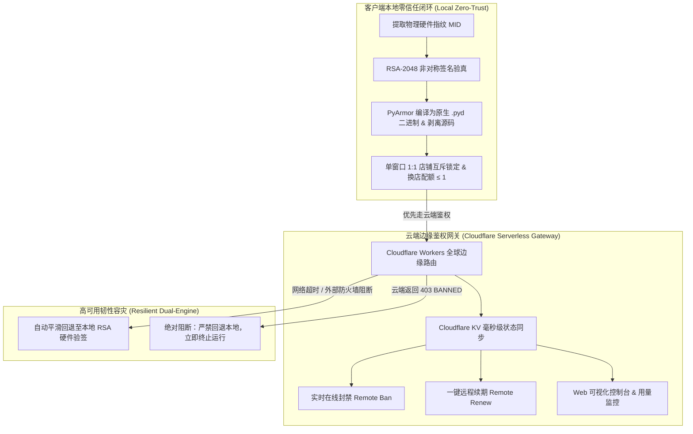

# Commercial License Guard 🛡️
## 企业级商业软件与 Agent Skill 防复刻、硬件一机一码绑定与 Cloudflare Serverless 授权管理全闭环系统

[](LICENSE)
[](https://python.org)
[](https://workers.cloudflare.com/)
[](https://pyarmor.readthedocs.io/)
[]()

---

## 🌟 项目简介 (Overview)

**Commercial License Guard** 是一套专为 Python 商业软件、独立开发者工具及 AI Agent Skill（如 Antigravity、Claude Code、OpenAI Codex 自动化工作流）设计的**企业级零信任商业化授权防护系统**。

在将自主研发的 AI Agent 技能或自动化脚本商业化销售给客户时，开发者通常面临巨大的被盗版风险：
- **源码与提示词裸奔**：Python `.py` 源码与 Agent 核心指令容易被客户轻易查看、篡改并二次倒卖；
- **一码多机与滥用轮播**：客户购买单份授权后拷贝至几十台电脑并发运行，或频繁轮换绑定上百家店铺白嫖；
- **服务器成本高昂且运维复杂**：传统的自建鉴权服务器（VPS、MySQL、Redis）费用昂贵且存在单点故障风险；
- **断网或海外阻断造成停摆**：若仅依赖云端校验，遇海外网络波动或运营商防火墙阻断时，正规付费客户因连不上服务器被迫停工，产生客诉危机。

**Commercial License Guard** 创新性地采用**“本地物理一机一码 + RSA-2048 非对称保密签名 + PyArmor 原生 C 扩展混淆 + Cloudflare Workers 全球边缘 Serverless 网关 + 双引擎容灾回退”**的混合零信任架构，彻底解决上述所有痛点！

---

## 🚀 核心防护体系 (Core Pillars)



### 1. 🔒 物理硬件一机一码强绑定 (Machine ID Binding)
- **不可伪造指纹**：深层采集主板 UUID、CPU 处理器序列号与系统盘卷标，通过加密盐与 SHA-256 算法生成专属硬件指纹：`MID-XXXX-XXXX-XXXX-XXXX`；
- **私钥离线签发**：RSA-2048 私钥（`admin_private_key.pem`）严格保留在开发者本地，数字签名随授权码一并下发；
- **跨机物理阻断**：客户若将授权码拷贝至其他设备运行，系统立即报 `Hardware mismatch` 并拒绝启动。

### 2. 🛡️ 源码 100% 剥离与 PyArmor 二进制混淆 (Binary Obfuscation)
- **编译为原生 C 扩展**：核心 Python 脚本通过 PyArmor 编译为 Windows 原生 `.pyd` 动态链接库，控制流平坦化并加密字节码；
- **明文代码物理剥离**：发布包中彻底删除所有业务 `.py` 明文文件；
- **全盘机密泄漏审计**：内置自动化检测脚本，打包前严格断言零私钥、零敏感 Token、零明文源码泄露。

### 3. 🚫 单窗口 1:1 店铺互斥与换店限额 (Store Mutex & Anti-Carousel)
- **1:1 专属锁定**：每个对话会话窗口物理互斥锁定 1 家店铺，杜绝多店铺串店污染；
- **单窗口限换店 1 次 (`switch_count <= 1`)**：防止商户购买 1 个授权轮播管理几十家店铺白嫖；换店 1 次后当前窗口永久锁定；
- **封死解绑绕过死锁**：换店配额耗尽后，彻底阻断 `解绑店铺` 操作，杜绝重置循环。

### 4. ☁️ 免服务器 Cloudflare Workers 云端网关 (Serverless Gateway)
- **0 成本 0 维护**：利用 Cloudflare 免费版（每日 10 万次请求），全球 edge 节点 sub-10ms 延迟，无需购买 VPS 或维护数据库；
- **免 CLI 浏览器极速部署**：直接利用 Chrome 已登录会话在网页端创建 Worker 与 KV，无需配置复杂的 wrangler CLI；
- **毫秒级在线封禁与续费**：管理员可在网页控制台（`/admin?key=...`）一键封禁违规客户或为到期客户续费；
- **实时上架用量监控**：客户端自动向 Cloudflare KV 上报批量处理用量，实时掌控商业版图。

### 5. ⚡ 高可用双引擎平滑容灾 (Dual-Engine Resilient Fallback)
- **公网弱网无感容灾**：当公网网络波动、DNS 污染或海外专线暂时中断时，系统自动平滑降级至本地 RSA-2048 硬件离线验签，付费客户业务永不停摆；
- **主动封禁绝对有效**：若云端明确返回 `403 BANNED`（管理员主动封禁），系统立即强行阻断并中止退出，绝对禁止降级；
- **防系统时钟倒流攻击**：内嵌签发时间 `iat` 校验，防止客户故意倒拨电脑时间白嫖延期；
- **注册表原子落盘**：采用 `tempfile` + `os.replace` 文件系统原子操作，杜绝掉电导致配置损坏。

---

## 📁 项目目录结构 (Directory Structure)

```text
commercial-license-guard/
├── .agents/
│   └── skills/
│       └── commercial-license-guard/
│           ├── SKILL.md                 # Agent Skill 规范定义 (10/10 满分品质)
│           ├── references/              # 模块深度参考指南
│           ├── scripts/                 # 自动化脚本与测试套件
│           └── templates/               # 生产部署模板
├── references/                          # 渐进式技术文档
│   ├── hardware_binding_rsa.md          # 硬件绑定与 RSA-2048 签名技术规范
│   ├── pyarmor_protected_build.md       # PyArmor 混淆与安全审计流水线
│   ├── cloudflare_workers_gateway.md    # Cloudflare 边缘网关与 Web 控制台说明
│   ├── anti_carousel_store_mutex.md     # 单窗口 1:1 互斥与换店限额设计
│   └── resilience_and_fallbacks.md      # 双引擎容灾、防倒流与原子持久化
├── scripts/                             # 命令行管理工具
│   ├── license_tool.py                  # 商业授权综合工具 (获取MID/签发/验签)
│   ├── build_pipeline.py                # 自动混淆编译与客户包打包流水线
│   └── test_skill.py                    # EVAL-01 ~ EVAL-05 自动化安全门禁测试
├── cloud/                               # 云端无服务器网关源码
│   └── worker.js                        # 生产级 Cloudflare Workers + KV 代码
├── templates/                           # 配置模板
│   ├── worker.js
│   └── config.example.json
├── config.example.json                  # 客户端配置示例
├── requirements.txt                     # 依赖库列表
├── LICENSE                              # MIT 开源协议
├── README.md                            # 项目主说明文档
├── USER_MANUAL.md                       # 新手运营与客户使用手册
└── SKILL.md                             # 根目录 Agent Skill 入口
```

---

## 🛠️ 快速上手 (Quick Start)

### 1. 环境依赖安装
```bash
pip install -r requirements.txt
```

### 2. 开发者（软件发布者）操作流程

#### 步骤 1：生成管理员 RSA 密钥对（仅需一次）
```bash
python scripts/license_tool.py keygen --out-dir .
```
> [!CAUTION]
> `admin_private_key.pem` 是最高权限私钥，必须严格保留在您的本地，**严禁分发**！生成的 `public_key.pem` 随软件打包给客户。

#### 步骤 2：为客户签发不可篡改授权码
获取客户的机器码后，运行以下指令签发 1 年期商业授权：
```bash
python scripts/license_tool.py generate \
    --key-path admin_private_key.pem \
    --mid "MID-XXXX-XXXX-XXXX-XXXX" \
    --name "VIP客户A" \
    --days 365
```

#### 步骤 3：一键混淆打包与安全审计
```bash
python scripts/build_pipeline.py --project-dir . --output-dir dist --name "my-product-v1.0"
```
构建脚本将全自动完成：
1. 清理历史构建缓存；
2. 将 `scripts/` 编译为原生 `.pyd` 二进制；
3. 全盘遍历扫描进行**安全泄漏审计**（严防私钥和敏感 Token）；
4. 沙箱环境中执行功能回归；
5. 打包生成 `dist/my-product-v1.0.zip`，直接交付给客户即可！

---

### 3. 云端控制台部署 (Cloudflare Workers)

1. 打开 Chrome 登录 [Cloudflare Dashboard](https://dash.cloudflare.com)；
2. 进入 **Workers & Pages** ➔ **Create Worker**；
3. 进入 **Storage & Databases** ➔ **KV**，新建命名空间 `WB_LICENSES`；
4. 在 Worker 设置的 **Bindings** 中绑定该 KV（变量名填写 `WB_LICENSES`）；
5. 在 **Environment Variables** 中设置 `ADMIN_SECRET = "您的管理员密钥"`；
6. 将 `cloud/worker.js` 的源码粘贴到 Worker Quick Edit 中并点击 **Deploy**！
7. 打开浏览器访问：`https://your-worker.workers.dev/admin?key=您的管理员密钥` 即可体验实时在线授权管理面板！

---

## 🧪 自动化测试套件 (Test Suite)

运行内置的 5 项核心安全回归测试：
```bash
python scripts/test_skill.py
```
**测试项覆盖**：
- ✅ `EVAL-01`：硬件指纹（MID）标准提取；
- ✅ `EVAL-02`：正常授权码离线验签通过；
- ✅ `EVAL-03`：跨机器盗用硬件指纹拦截阻断；
- ✅ `EVAL-04`：篡改 1 位字符签名破坏拦截阻断；
- ✅ `EVAL-05`：过期授权自动失效拦截阻断。

---

## 📄 开源许可 (License)

本项目采用 [MIT License](LICENSE) 协议发布。
